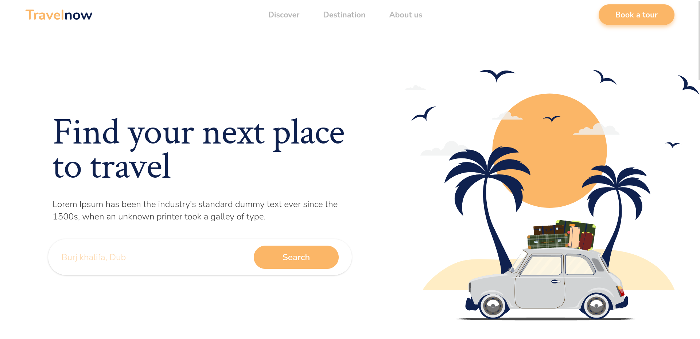

<h1 align="center">Travelnow</h1>

> Status do Projeto: Concluido :heavy_check_mark:
## Descrição do Projeto

Projeto desenvolvido durante o Núcleo de estudos Web da [InfoJr UFBA](https://br.linkedin.com/company/infojrufba) com o objetivo de introdução ao React. Consiste num site estático de uma agência de viagens fictícia chamada Travelnow. 

## :books: Libs e Dependências Utilizadas

- [React](https://pt-br.reactjs.org/)
- [Vite](https://vitejs.dev/)

## 📁 Acesso ao Projeto

Foi feito o deploy do site pela plataforma [Netlify](https://www.netlify.com/) e você pode acessá-lo através desse [link](https://vigorous-brown-c04b23.netlify.app/).
